# Class Diagram — Bakery Order and Custom Cake Booking Platform
### SE1020 Object Oriented Programming Project

---

> **How to view the full diagram:**
> - Open `class-diagram.puml` in VS Code with the **PlantUML extension** installed
> - Or paste into → https://www.plantuml.com/plantuml/uml/

---

## Full Class Diagram (Mermaid — renders on GitHub)

```mermaid
classDiagram
    direction TB

    %% ── ENUMERATIONS ──────────────────────────────────────────

    class OrderStatus {
        <<enumeration>>
        PENDING
        CONFIRMED
        DELIVERED
        CANCELLED
    }

    class OrderType {
        <<enumeration>>
        STANDARD
        EXPRESS
        PICKUP
    }

    class BookingStatus {
        <<enumeration>>
        PENDING
        APPROVED
        IN_PROGRESS
        READY
        CANCELLED
    }

    %% ── MODEL LAYER ───────────────────────────────────────────

    class Customer {
        <<Entity>>
        - Long id
        - String name
        - String email
        - String password
        - String phone
        - String address
        + Customer()
        + Customer(name, email, password, phone, address)
        + getId() Long
        + getName() String
        + getEmail() String
        + getPhone() String
        + getAddress() String
        + setName(String) void
        + setEmail(String) void
        + setPassword(String) void
        + setPhone(String) void
        + setAddress(String) void
        + toString() String
    }

    class Cake {
        <<Entity>>
        - Long id
        - String name
        - String description
        - Double price
        - String size
        - String flavor
        - String cakeType
        + Cake()
        + Cake(name, description, price, size, flavor)
        + getId() Long
        + getName() String
        + getDescription() String
        + getPrice() Double
        + getSize() String
        + getFlavor() String
        + getCakeType() String
        + setName(String) void
        + setDescription(String) void
        + setPrice(Double) void
        + setSize(String) void
        + setFlavor(String) void
        + toString() String
    }

    class BirthdayCake {
        <<Entity>>
        - String ageGroup
        - String theme
        + BirthdayCake()
        + BirthdayCake(name, desc, price, size, flavor, ageGroup, theme)
        + getAgeGroup() String
        + getTheme() String
        + setAgeGroup(String) void
        + setTheme(String) void
        + toString() String
    }

    class WeddingCake {
        <<Entity>>
        - Integer tiers
        - String decorationStyle
        + WeddingCake()
        + WeddingCake(name, desc, price, size, flavor, tiers, decorationStyle)
        + getTiers() Integer
        + getDecorationStyle() String
        + setTiers(Integer) void
        + setDecorationStyle(String) void
        + toString() String
    }

    class Order {
        <<Entity>>
        - Long id
        - Integer quantity
        - Double totalPrice
        - LocalDate orderDate
        - OrderStatus status
        - OrderType orderType
        - String deliveryAddress
        + Order()
        + Order(customer, cake, quantity, deliveryAddress, orderType)
        + getOrderSummary() String
        + getId() Long
        + getQuantity() Integer
        + getTotalPrice() Double
        + getOrderDate() LocalDate
        + getStatus() OrderStatus
        + getOrderType() OrderType
        + getDeliveryAddress() String
        + setQuantity(Integer) void
        + setTotalPrice(Double) void
        + setStatus(OrderStatus) void
        + setOrderType(OrderType) void
        + setDeliveryAddress(String) void
        + toString() String
    }

    class CustomCake {
        <<Entity>>
        - Long id
        - String description
        - String size
        - String flavor
        - Double estimatedPrice
        - LocalDate deliveryDate
        - LocalDate bookingDate
        - BookingStatus status
        - String customType
        + CustomCake()
        + CustomCake(customer, description, size, flavor, deliveryDate)
        + getId() Long
        + getDescription() String
        + getSize() String
        + getFlavor() String
        + getEstimatedPrice() Double
        + getDeliveryDate() LocalDate
        + getBookingDate() LocalDate
        + getStatus() BookingStatus
        + getCustomType() String
        + setDescription(String) void
        + setSize(String) void
        + setFlavor(String) void
        + setEstimatedPrice(Double) void
        + setDeliveryDate(LocalDate) void
        + setStatus(BookingStatus) void
        + toString() String
    }

    class ThemeCake {
        <<Entity>>
        - String theme
        - String characterName
        + ThemeCake()
        + ThemeCake(customer, desc, size, flavor, date, theme, characterName)
        + getTheme() String
        + getCharacterName() String
        + setTheme(String) void
        + setCharacterName(String) void
        + toString() String
    }

    class PhotoCake {
        <<Entity>>
        - String photoDescription
        - String printType
        + PhotoCake()
        + PhotoCake(customer, desc, size, flavor, date, photoDesc, printType)
        + getPhotoDescription() String
        + getPrintType() String
        + setPhotoDescription(String) void
        + setPrintType(String) void
        + toString() String
    }

    %% ── REPOSITORY LAYER ──────────────────────────────────────

    class JpaRepository {
        <<interface>>
        + save(T) T
        + findById(ID) Optional~T~
        + findAll() List~T~
        + deleteById(ID) void
        + count() long
        + existsById(ID) boolean
    }

    class CustomerRepository {
        <<interface>>
        + findByEmail(String) Optional~Customer~
        + existsByEmail(String) boolean
    }

    class CakeRepository {
        <<interface>>
        + findByNameContainingIgnoreCase(String) List~Cake~
        + findByCakeType(String) List~Cake~
    }

    class OrderRepository {
        <<interface>>
        + findByCustomerId(Long) List~Order~
        + findByStatus(OrderStatus) List~Order~
    }

    class CustomCakeRepository {
        <<interface>>
        + findByCustomerId(Long) List~CustomCake~
        + findByStatus(BookingStatus) List~CustomCake~
    }

    %% ── SERVICE LAYER ─────────────────────────────────────────

    class CustomerService {
        <<Service>>
        - customerRepository : CustomerRepository
        + register(Customer) Customer
        + login(String, String) Optional~Customer~
        + getAllCustomers() List~Customer~
        + getCustomerById(Long) Optional~Customer~
        + updateCustomer(Long, Customer) Customer
        + deleteCustomer(Long) void
    }

    class CakeService {
        <<Service>>
        - cakeRepository : CakeRepository
        + addCake(Cake) Cake
        + getAllCakes() List~Cake~
        + getCakeById(Long) Optional~Cake~
        + searchCakes(String) List~Cake~
        + getCakesByType(String) List~Cake~
        + updateCake(Long, Cake) Cake
        + deleteCake(Long) void
    }

    class OrderService {
        <<Service>>
        - orderRepository : OrderRepository
        - customerRepository : CustomerRepository
        - cakeRepository : CakeRepository
        + placeOrder(Long, Long, Integer, String, String) Order
        + getAllOrders() List~Order~
        + getOrdersByCustomer(Long) List~Order~
        + getOrderById(Long) Optional~Order~
        + updateOrder(Long, Integer, String, String) Order
        + updateOrderStatus(Long, String) Order
        + cancelOrder(Long) void
    }

    class CustomCakeService {
        <<Service>>
        - customCakeRepository : CustomCakeRepository
        - customerRepository : CustomerRepository
        + bookCustomCake(Long, CustomCake) CustomCake
        + bookThemeCake(Long, ...) ThemeCake
        + bookPhotoCake(Long, ...) PhotoCake
        + getAllBookings() List~CustomCake~
        + getBookingsByCustomer(Long) List~CustomCake~
        + getBookingById(Long) Optional~CustomCake~
        + updateBooking(Long, CustomCake) CustomCake
        + updateBookingStatus(Long, String) CustomCake
        + cancelBooking(Long) void
    }

    %% ── CONTROLLER LAYER ──────────────────────────────────────

    class CustomerController {
        <<RestController>>
        - customerService : CustomerService
        + register(Customer) ResponseEntity
        + login(Map) ResponseEntity
        + getAllCustomers() ResponseEntity
        + getCustomerById(Long) ResponseEntity
        + updateCustomer(Long, Customer) ResponseEntity
        + deleteCustomer(Long) ResponseEntity
    }

    class CakeController {
        <<RestController>>
        - cakeService : CakeService
        + addCake(Cake) ResponseEntity
        + addBirthdayCake(BirthdayCake) ResponseEntity
        + addWeddingCake(WeddingCake) ResponseEntity
        + getAllCakes() ResponseEntity
        + getCakeById(Long) ResponseEntity
        + searchCakes(String) ResponseEntity
        + getCakesByType(String) ResponseEntity
        + updateCake(Long, Cake) ResponseEntity
        + deleteCake(Long) ResponseEntity
    }

    class OrderController {
        <<RestController>>
        - orderService : OrderService
        + placeOrder(Map) ResponseEntity
        + getAllOrders() ResponseEntity
        + getOrderById(Long) ResponseEntity
        + getOrdersByCustomer(Long) ResponseEntity
        + updateOrder(Long, Map) ResponseEntity
        + updateOrderStatus(Long, Map) ResponseEntity
        + cancelOrder(Long) ResponseEntity
    }

    class CustomCakeController {
        <<RestController>>
        - customCakeService : CustomCakeService
        + bookCustomCake(Map) ResponseEntity
        + getAllBookings() ResponseEntity
        + getBookingById(Long) ResponseEntity
        + getBookingsByCustomer(Long) ResponseEntity
        + updateBooking(Long, CustomCake) ResponseEntity
        + updateBookingStatus(Long, Map) ResponseEntity
        + cancelBooking(Long) ResponseEntity
    }

    %% ── INHERITANCE ───────────────────────────────────────────
    Cake       <|-- BirthdayCake        : extends
    Cake       <|-- WeddingCake         : extends
    CustomCake <|-- ThemeCake           : extends
    CustomCake <|-- PhotoCake           : extends

    JpaRepository <|.. CustomerRepository    : implements
    JpaRepository <|.. CakeRepository        : implements
    JpaRepository <|.. OrderRepository       : implements
    JpaRepository <|.. CustomCakeRepository  : implements

    %% ── ASSOCIATIONS ──────────────────────────────────────────
    Order      "many" --> "1" Customer   : placed by
    Order      "many" --> "1" Cake       : contains
    CustomCake "many" --> "1" Customer   : booked by

    Order      ..> OrderStatus    : uses
    Order      ..> OrderType      : uses
    CustomCake ..> BookingStatus  : uses

    %% ── SERVICE → REPOSITORY ──────────────────────────────────
    CustomerService   ..> CustomerRepository   : uses
    CakeService       ..> CakeRepository       : uses
    OrderService      ..> OrderRepository      : uses
    OrderService      ..> CustomerRepository   : uses
    OrderService      ..> CakeRepository       : uses
    CustomCakeService ..> CustomCakeRepository : uses
    CustomCakeService ..> CustomerRepository   : uses

    %% ── CONTROLLER → SERVICE ──────────────────────────────────
    CustomerController   ..> CustomerService   : uses
    CakeController       ..> CakeService       : uses
    OrderController      ..> OrderService      : uses
    CustomCakeController ..> CustomCakeService : uses
```



---

## Architecture — Layer Overview

```
╔══════════════════════════════════════════════════════════════╗
║           CONTROLLER LAYER  (@RestController)                ║
║  ┌────────────────┐  ┌─────────────┐  ┌────────────────┐   ║
║  │CustomerController│ │CakeController│ │ OrderController│   ║
║  └────────────────┘  └─────────────┘  └────────────────┘   ║
║              ┌──────────────────────────┐                   ║
║              │  CustomCakeController    │                   ║
║              └──────────────────────────┘                   ║
╠══════════════════════════════════════════════════════════════╣
║               SERVICE LAYER  (@Service)                      ║
║  ┌───────────────┐  ┌──────────────┐  ┌──────────────┐     ║
║  │CustomerService│  │  CakeService │  │ OrderService  │     ║
║  └───────────────┘  └──────────────┘  └──────────────┘     ║
║              ┌──────────────────────────┐                   ║
║              │    CustomCakeService     │                   ║
║              └──────────────────────────┘                   ║
╠══════════════════════════════════════════════════════════════╣
║            REPOSITORY LAYER  (@Repository)                   ║
║  ┌──────────────────┐   ┌────────────────┐                  ║
║  │CustomerRepository│   │ CakeRepository │                  ║
║  └──────────────────┘   └────────────────┘                  ║
║  ┌──────────────────┐   ┌─────────────────────┐             ║
║  │ OrderRepository  │   │CustomCakeRepository │             ║
║  └──────────────────┘   └─────────────────────┘             ║
║  (All extend JpaRepository — CRUD operations)                ║
╠══════════════════════════════════════════════════════════════╣
║                 MODEL LAYER  (@Entity)                       ║
║                                                              ║
║   Customer                                                   ║
║                                                              ║
║   Cake  ──────────┬── BirthdayCake  (+ageGroup, +theme)     ║
║   (parent)        └── WeddingCake   (+tiers, +decoStyle)    ║
║                                                              ║
║   Order ──── @ManyToOne ──► Customer                        ║
║         ──── @ManyToOne ──► Cake                            ║
║         ├── OrderStatus  { PENDING | CONFIRMED |             ║
║         │                  DELIVERED | CANCELLED }           ║
║         └── OrderType    { STANDARD | EXPRESS | PICKUP }    ║
║                                                              ║
║   CustomCake ─────┬── ThemeCake  (+theme, +characterName)   ║
║   @ManyToOne ──►  └── PhotoCake  (+photoDesc, +printType)   ║
║   Customer                                                   ║
║         └── BookingStatus { PENDING | APPROVED |             ║
║                             IN_PROGRESS | READY |            ║
║                             CANCELLED }                      ║
╚══════════════════════════════════════════════════════════════╝
```

---

## OOP Concepts in This Project

| OOP Concept | Class / Method | How |
|---|---|---|
| **Encapsulation** | `Customer`, `Cake`, `Order`, `CustomCake` | All fields `private`, accessed via `get/set` methods |
| **Inheritance** | `BirthdayCake extends Cake` | Reuses `name`, `price`, `size`, `flavor` from `Cake` |
| **Inheritance** | `WeddingCake extends Cake` | Adds `tiers` and `decorationStyle` on top of `Cake` |
| **Inheritance** | `ThemeCake extends CustomCake` | Adds `theme` and `characterName` |
| **Inheritance** | `PhotoCake extends CustomCake` | Adds `photoDescription` and `printType` |
| **Polymorphism** | `Order.getOrderSummary()` | Returns different output for STANDARD / EXPRESS / PICKUP |
| **Abstraction** | `JpaRepository` interface | Hides all SQL — we just call `.save()`, `.findAll()` |

---

## Relationships Summary

| Relationship | From | To | Type |
|---|---|---|---|
| extends | `BirthdayCake` | `Cake` | Inheritance |
| extends | `WeddingCake` | `Cake` | Inheritance |
| extends | `ThemeCake` | `CustomCake` | Inheritance |
| extends | `PhotoCake` | `CustomCake` | Inheritance |
| implements | All Repositories | `JpaRepository` | Realization |
| @ManyToOne | `Order` | `Customer` | Association (Many → One) |
| @ManyToOne | `Order` | `Cake` | Association (Many → One) |
| @ManyToOne | `CustomCake` | `Customer` | Association (Many → One) |
| uses | All Services | Repositories | Dependency |
| uses | All Controllers | Services | Dependency |
